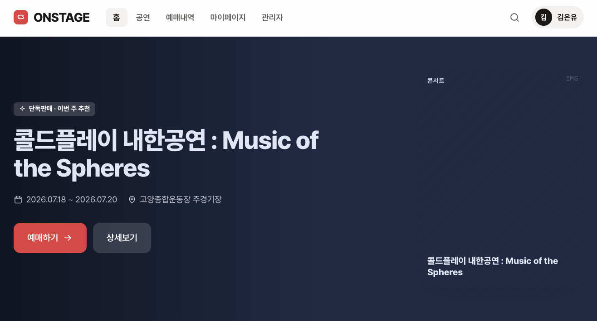
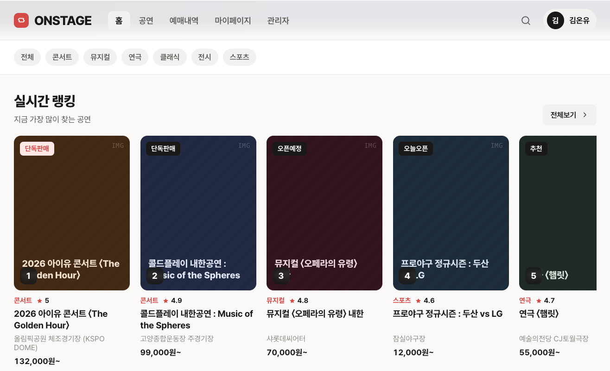
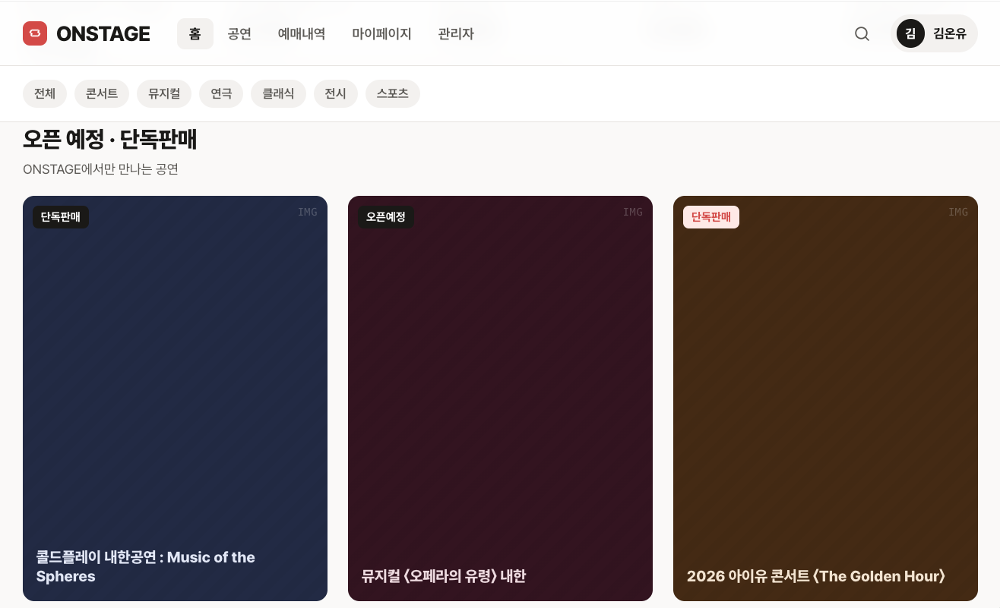
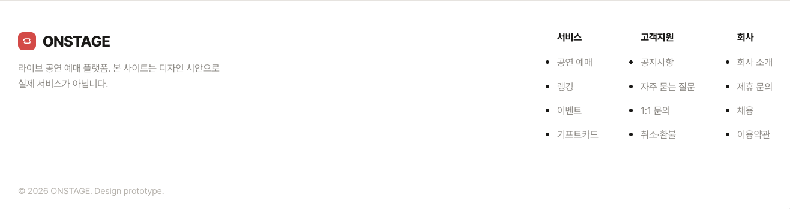

## 개요

MOA TICKET 프로젝트를 위한 인터렉티브한 웹 빌더 CLI 툴킷입니다.
Next.js 기반으로 반응형 SPA 웹을 구현합니다.

## 워크플로우 단계

### 1단계: 기술 스택 학습

- Context7 MCP 기반으로 다음을 스터디:
  - Next.js 15.1.8 (App Router)
  - React 19.0.0
  - TypeScript 5.7.3
  - Tailwind CSS 4.0
  - Zustand (상태 관리)
  - Tanstack React Query (API)

### 2단계: UI/UX 구현

- 화면 설계를 기반으로 UI/UX 구현
- 참고 디자인: https://claude.ai/design/p/d945bfba-3784-43f4-bf20-deb8d8b5e787?file=ONSTAGE+%ED%8B%B0%EC%BC%93+%EC%98%88%EB%A7%A4.html

메인 페이지




fi

### 3단계: 로그인/회원가입 구현

- 제공된 스크린샷을 기준으로 구현
- 로고명: **MOA TICKET** (ONSTAGE 아님)
- 완전 반응형 디자인 (모바일, 태블릿, 데스크톱)

### 4단계: 컴포넌트 분리

각 영역을 **최소 2~3개의 컴포넌트 레벨**로 나눔:

- **Login Page**
  - LoginLeftComponent (다크 섹션)
  - LoginRightComponent (폼 섹션)

- **Signup Page**
  - SignupLeftComponent (다크 섹션)
  - SignupRightComponent (폼 섹션)

### 5단계: 디자인 시스템 적용

#### 컬러 팔레트

- **Primary (Accent)**: #ed4543 (MOA Red)
- **Dark Background**: #311917 (다크 브라운)
- **Black**: #000
- **White**: #fff
- **Gray**: 다양한 회색톤 (gray-50 ~ gray-900)

#### Spacing

- `4px` (0.25rem) - xs
- `8px` (0.5rem) - sm
- `12px` (0.75rem)
- `16px` (1rem) - default
- `20px` (1.25rem)
- `24px` (1.5rem)
- `32px` (2rem) - lg

#### Elevation (그림자)

- `shadow-sm`: 가벼운 그림자
- `shadow-md`: 중간 그림자
- `shadow-lg`: 강한 그림자
- `shadow-xl`: 매우 강한 그림자

#### Scale (타이포그래피)

- `text-xs`: 12px
- `text-sm`: 14px
- `text-base`: 16px (default)
- `text-lg`: 18px
- `text-xl`: 20px
- `text-2xl`: 24px
- `text-3xl`: 30px
- `text-4xl`: 36px

## 구현된 기능

### 페이지 목록

1. ✅ `/` - 메인 페이지 (반응형)
2. ✅ `/login` - 로그인 페이지 (완전 반응형 - 데스크톱 좌우 2단, 모바일 전체)
3. ✅ `/signup` - 회원가입 페이지 (완전 반응형 - 데스크톱 좌우 2단, 모바일 전체)
4. ✅ `/concerts` - 공연 목록 (완전 반응형)
5. ✅ `/concerts/[id]` - 공연 상세 (완전 반응형)
6. ✅ `/bookings` - 예매 내역 (완전 반응형)
7. ✅ `/profile` - 마이페이지 (완전 반응형)
8. ✅ `/admin` - 관리자 대시보드

### 반응형 설계

모든 페이지는 **완전 반응형**:

- **모바일**: `px-4` (320px+)
- **태블릿**: `sm:px-6` (640px+)
- **데스크톱**: `lg:` 프리픽스 (1024px+)

### 컴포넌트 구조

```
src/
├── shared/
│   ├── ui/
│   │   ├── Header.tsx (공통 헤더)
│   │   ├── ClientOnlyWrapper.tsx
│   │   └── DarkModeToggle.tsx
│   ├── hooks/ (hydration 안전 훅)
│   ├── stores/ (Zustand authStore)
│   └── providers/ (QueryClientProvider)
├── widgets/
│   ├── login/
│   │   ├── LoginLeftComponent.tsx
│   │   └── LoginRightComponent.tsx
│   └── signup/
│       ├── SignupLeftComponent.tsx
│       └── SignupRightComponent.tsx
└── app/
    ├── page.tsx
    ├── login/page.tsx
    ├── signup/page.tsx
    ├── concerts/
    ├── bookings/page.tsx
    ├── profile/page.tsx
    └── admin/page.tsx
```

## 개발 명령어

### Build Check (타입 + 린트 + 포맷)

```bash
npm run build:check
python3 .claude/skills/moa-web-builder/scripts/build_check.py
```

### Full Build (포맷 + 빌드)

```bash
npm run build:full
python3 .claude/skills/moa-web-builder/scripts/build_full.py
```

### 개발 서버

```bash
npm run dev
python3 .claude/skills/moa-web-builder/scripts/dev_server.py
```

### 타입 검사

```bash
npm run type-check
python3 .claude/skills/moa-web-builder/scripts/type_check.py
```

### 린트 검사

```bash
npm run lint
python3 .claude/skills/moa-web-builder/scripts/lint.py
```

### 코드 포맷

```bash
npm run format
python3 .claude/skills/moa-web-builder/scripts/format.py
```

### 캐시 정리

```bash
npm run clean
python3 .claude/skills/moa-web-builder/scripts/clean.py
```

## 기술 스택

| 항목         | 버전    |
| ------------ | ------- |
| Next.js      | 15.1.8  |
| React        | 19.0.0  |
| TypeScript   | 5.7.3   |
| Tailwind CSS | 4.0     |
| Zustand      | 5.0.14  |
| React Query  | 5.101.0 |
| ESLint       | 9.0.0   |
| Prettier     | 3.5.3   |

## 아키텍처

### FSD (Feature-Sliced Design)

- **Feature**: 비즈니스 로직 단위
- **Slices**: 각 기능의 수평 분할
- **Layers**: 코드 복잡도별 수직 분할

### 상태 관리

- **Zustand**: 간단한 전역 상태 (authStore)
- **React Query**: 서버 상태 관리

## 주의사항

1. 모든 새 페이지는 Header 컴포넌트를 포함해야 함
2. Login/Signup은 Header를 포함하지 않음 (전체 화면 레이아웃)
3. 모든 색상은 정의된 팔레트를 사용
4. 반응형 클래스 사용: `sm:`, `lg:` 프리픽스
5. 컴포넌트 분리: 최소 2~3 레벨
6. Login/Signup: `h-screen` (정확히 100vh) 고정
7. 모바일 화면: 좌측 섹션 숨김 (`hidden lg:flex`)

## 참고 자료

- 디자인 파일: https://claude.ai/design/p/d945bfba-3784-43f4-bf20-deb8d8b5e787?file=ONSTAGE+%ED%8B%B0%EC%BC%93+%EC%98%88%EB%A7%A4.html
- FSD 구조: `FSD_STRUCTURE.md`
- Hydration 가이드: `src/shared/hooks/HYDRATION_GUIDE.md`
